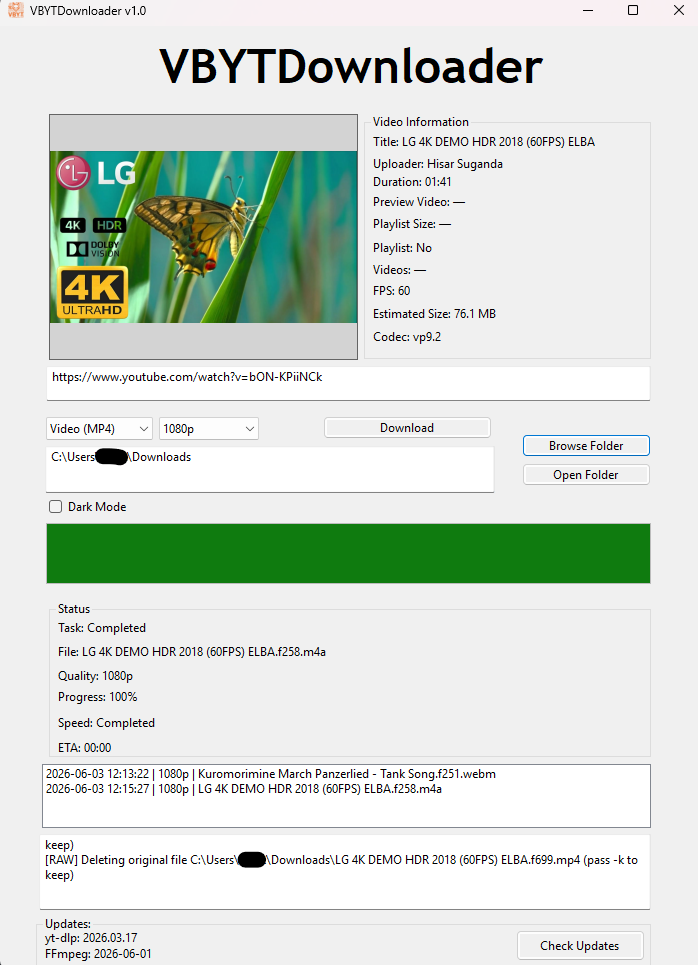
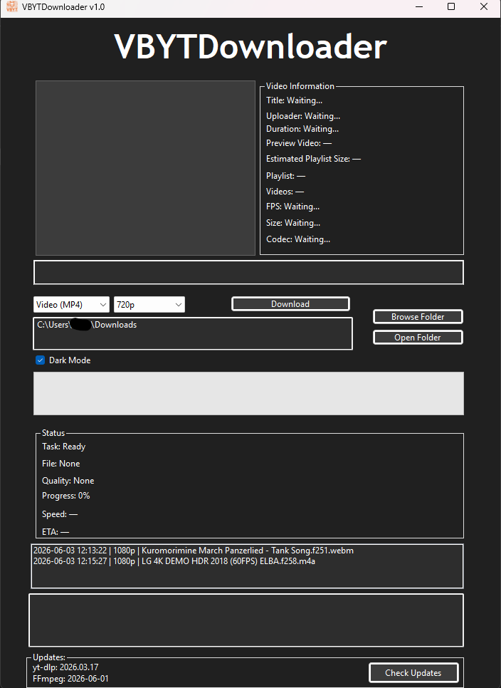

# VBYTDownloader v1.0
A VB.NET YouTube downloader powered by yt-dlp and FFmpeg.

## Default Theme

## Dark Mode

## FEATURES
* MP4 Downloads (360p, 480p, 720p, 1080p)
* MP3 Downloads
* Playlist Downloads
* Thumbnail Preview
* FPS Detection
* Codec Detection
* Estimated Video Size
* Estimated Playlist Size
* Download History
* Dark Mode
* Update Checker

## HOW TO USE
1. Paste a YouTube video or playlist URL.
2. Select MP4 or MP3.
3. Choose quality.
4. Click Download.

## Notes
* VBYTDownloader currently downloads one URL at a time.
* To download multiple videos in a single operation, consider using a YouTube playlist. Playlist URLs are fully supported and all videos in the playlist will be downloaded automatically.
* Playlist information such as video count and estimated playlist size is displayed before downloading.

## Playlist Support
VBYTDownloader supports YouTube playlists.

**Supported:**
* Public playlists
* Unlisted playlists

**Not supported:**
* Private playlists requiring account access
* Playlists containing videos that are unavailable, deleted, or restricted

## Known Limitations
* Download queueing is not currently supported. Only one URL can be downloaded at a time.
* Playlist size estimates are approximate and may differ from the final downloaded size.
* Some metadata (FPS, codec, file size) depends on information provided by the source website and may occasionally be unavailable.
* Tested primarily with YouTube videos and playlists.
* Windows only.

## Planned Features
* Download queue support
* Batch URL downloads
* Improved playlist size estimation
* Automatic yt-dlp and FFmpeg updates
* Additional quality and format options

## Acknowledgements
This project relies heavily on the incredible work of the open-source community. Special thanks to:
* **[yt-dlp](https://github.com/yt-dlp/yt-dlp):** The core command-line media downloader that powers the video and audio extraction.
* **[FFmpeg](https://ffmpeg.org/):** The essential multimedia framework used for processing, converting, and merging the downloaded media streams.

## Disclaimer
**VBYTDownloader is intended for educational and personal use only.** * **Copyright & TOS:** Users are strictly responsible for ensuring that their use of this software complies with YouTube's Terms of Service and local copyright laws. Do not use this application to download copyrighted material without explicit permission from the rightful owner.
* **Liability:** The developer of this software assumes no liability for any misuse, copyright infringement, or violations of third-party terms of service committed by users of this application.
* **Warranty:** This project is provided "as is" without warranty of any kind. 

---
Created by Mark LGM | tachyon.
